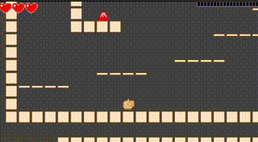

# いのべーしょん2007 (for Godot)

## 概要
いのべーしょん2007 (for Godot)は、[おめが（　゜ヮ゜）ノ@Omegamega](https://twitter.com/Omegamega) さん開発の[いのべーしょん2007](http://o-mega.sakura.ne.jp/product/ino.html)を Godot Engine に移植（一部不完全）したものです。

## 実行ファイル

* x64版: [x64.zip](./exports/x64.zip)

## ライセンスについて

特に権利上問題となるデータはないはずなので、自由に使ってもらったり改変してもらってOKだと思います。

> 本ゲームは「みんなで楽しく」やわらかいです。
> 
> 本ゲームを改造したりイジったバージョンを配布しても、何らOKです。改造たのしーい！
> 改造したところや改造した人の名前を、分かりやすいところに書いておくと
> いいかもしれません。
> 
> ナイスな改造が出来たら　メールなどで教えて。俺にも遊ばせてください。
> 
> 改造とか一切してないものは好きにコピーして配布しちゃって結構結構。
> 
> readme_jp.txtより

当時「やわらかライセンス」というのが提唱されていたので、このコードとデータもそれに準拠します。(Github上では MITライセンスとしています）。

### オリジナル版との違い

* 実績の実装：（例えば収集アイテムをコンプリートする）と実績リストが更新されます
* オプション画面：オープニング・エンディングの自動スキップのON/OFF、クイックリトライ、BGM/SEの音量の設定などができます
* ランカーモードの調整：ランカーモードとは、プリンス・オブ・ペルシャのように、高いところから落下でダメージまたは即死する高難易度モードです。ただ、ダメージ基準がわかりにくいように感じたので補助線表示機能を実装しました。またBGMもランカーモード専用の楽曲としています

基本的なゲームデザインはオリジナル版そのままで、オリジナル版に入っていた "memo.txt" に色々と遊ばせるためのアイデアが書いてあったので、それを参考に実績を作った流れです。

ただコリジョン周りでオリジナル版通りに再現できない部分がいくつかあって、そのあたりがオリジナル版と異なります。例えばオリジナルだと1マスの横穴に入ることができないのですが、Godot版だと入ることができてしまうため少し難易度が下がっています。

### その他

Godotの技術的な話や、ゲームデザインの考察は以下のページに記載しています。

* https://2dgames.jp/inovation-2007-for-godot

